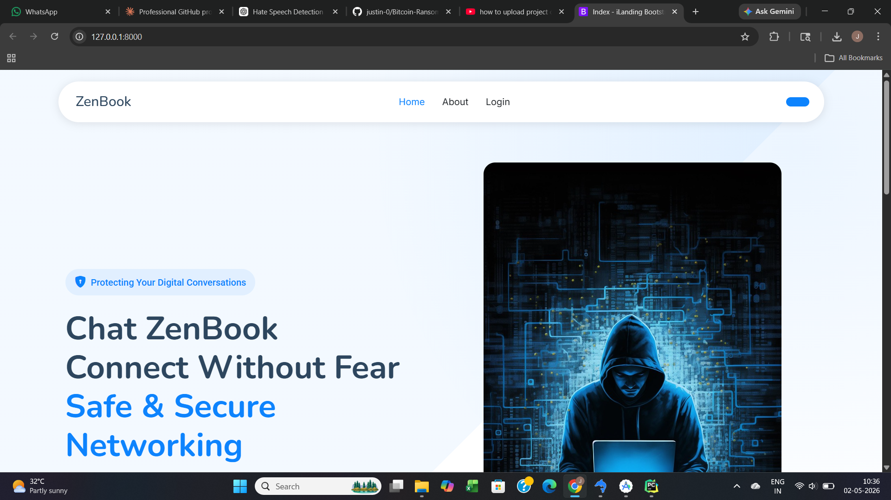
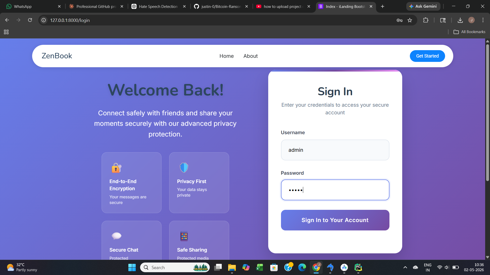
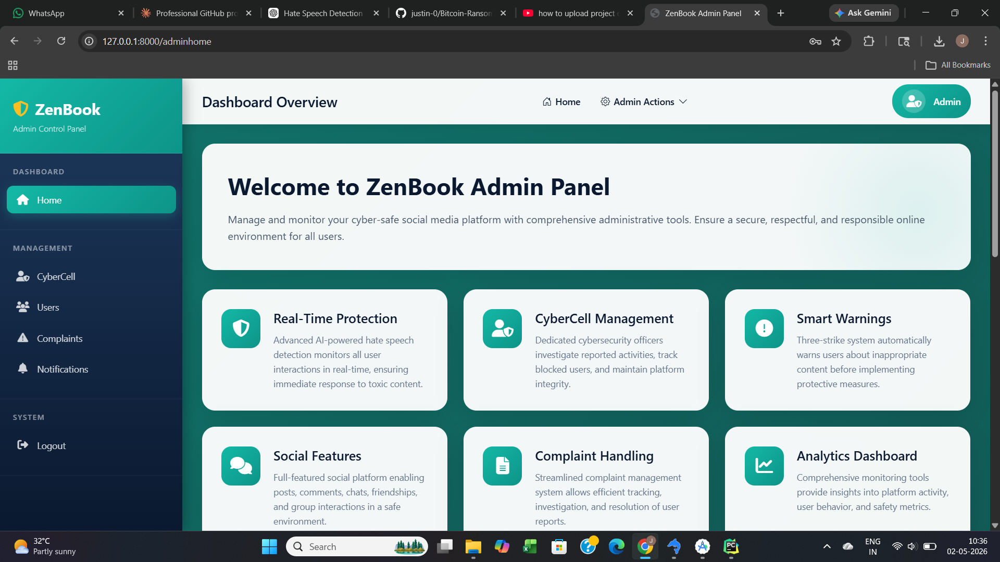
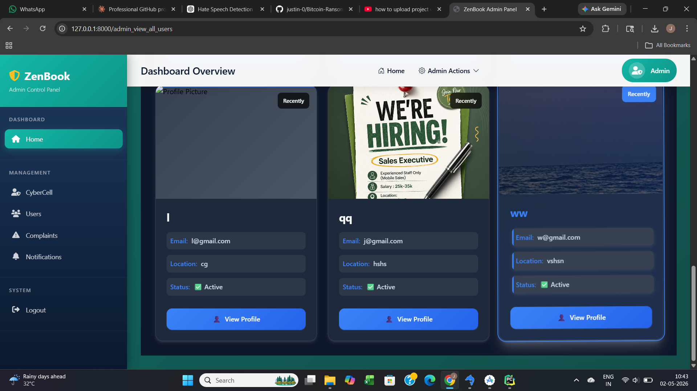
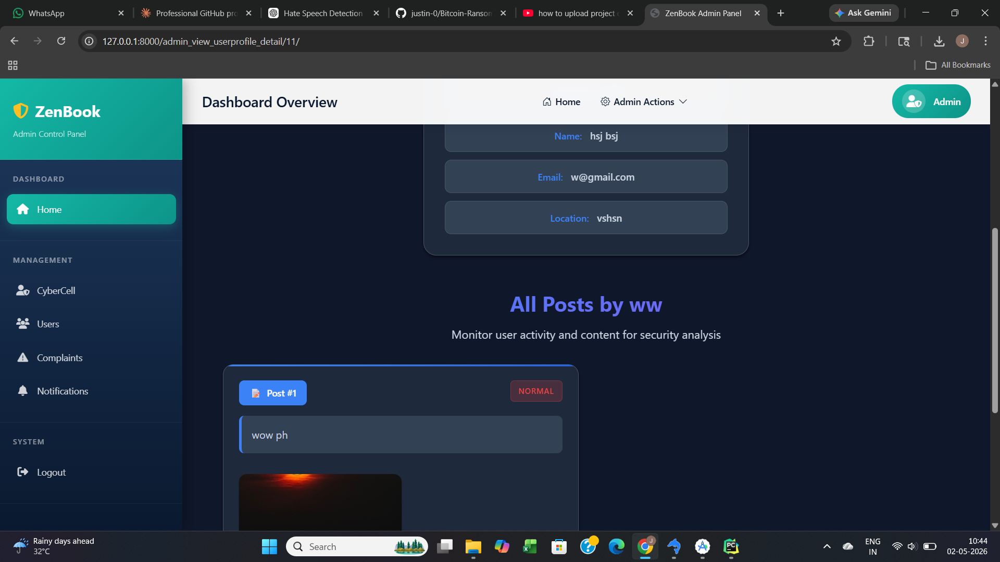

# 📘 ZenBook — Social Media Web Application

ZenBook is a full-featured social media web application similar to Facebook, built with Django and Flutter. It includes AI-powered content moderation using Machine Learning models to detect toxic comments and violent/vulgar images.

---

## 📸 Screenshots

### 🏠 Landing Page


### 🔐 Login Page


### 👮 Admin Dashboard


### 👥 Admin - All Users


### 📝 Admin - User Posts


---

## 🚀 Features

- 👤 User Registration & Authentication
- 📝 Post Creation (Text, Image, Video)
- 💬 Comments & Replies
- 👍 Like & React to Posts
- 👫 Friend Request System
- 💌 Private Chat (One-to-One Messaging)
- 👥 Group Chat
- 🤖 AI Toxic Comment Detection (warns user after 3 violations → auto block)
- 🖼️ AI Vulgar Image Detection (blocks inappropriate image uploads)
- 🔔 Notifications
- 👮 Admin Panel (manage users, posts, comments, complaints)
- 🚨 CyberCell Panel (view reported content)
- 📱 Mobile App Support via Flutter

---

## 🛠️ Tech Stack

| Layer | Technology |
|-------|-----------|
| Backend | Python, Django 5.0 |
| Frontend | HTML, CSS, Bootstrap, JavaScript |
| Mobile App | Flutter (Android) |
| Database | MySQL |
| ML - Toxic Comment Detection | PyTorch, Transformers, Scikit-learn |
| ML - Image Moderation | TorchVision |
| Speech | SpeechRecognition, FFmpeg |
| Others | Pillow, Pandas, NumPy |

---

## 🤖 ML Models Used

### 1. Toxic Comment Detection
- Detects harmful/toxic comments in English and Manglish (Malayalam-English)
- User gets a **warning** after each toxic comment
- After **3 warnings** → user is **automatically blocked**

### 2. Violence/Vulgar Image Detection
- Detects inappropriate images before upload
- Blocks the upload if image is flagged as violent or vulgar

> ⚠️ ML model files are not included in this repo due to large size.

---

## ⚙️ How to Run Locally

### Prerequisites
- Python 3.12
- MySQL
- pip

### Steps

**1. Clone the repository**
```bash
git clone https://github.com/justin-0/zenbook-web.git
cd zenbook-web
```

**2. Install dependencies**
```bash
pip install -r requirements.txt
```

**3. Create `.env` file in root folder**

## 📱 Mobile App

The Flutter Android app repository is available here:
👉 [zenbook-android](https://github.com/justin-0/zenbook-android)